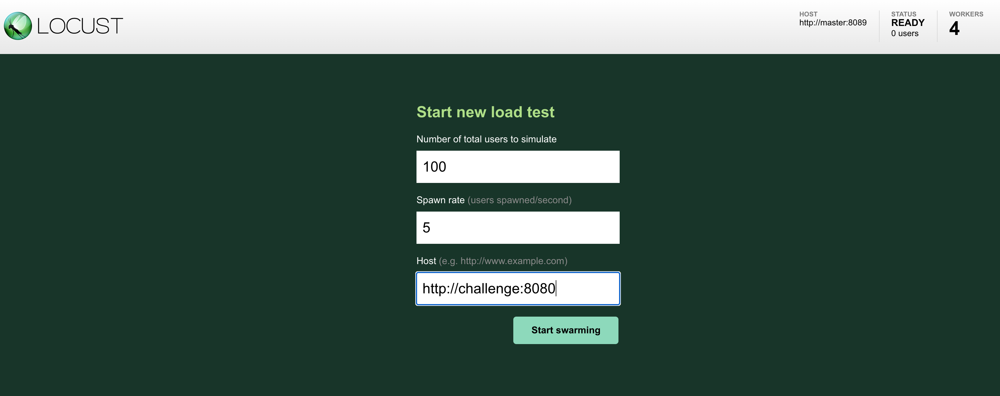
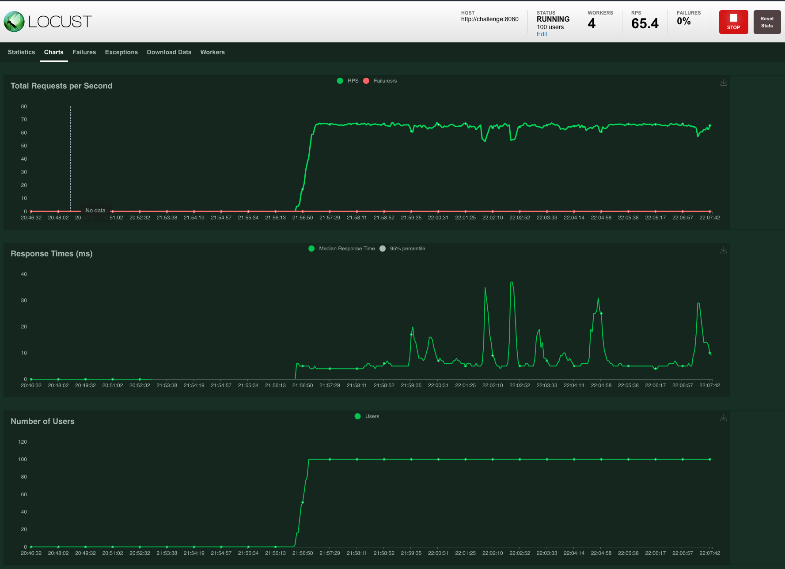

# coding-challenge-go

This repository contains my solution to the go coding challenge.

## Assumptions

The objective of the system is to batch low volume transactions to send them altogether to the users and not spam their bank accounts. Here are the assumptions I made:

* For each operation, we require a user identifier. For example, when we receive a transaction to add it to the batch, we should get the amount, but also the user identifier. This way, when we dispatch the batch, we know to which user we should dispatch it. For simplicity reasons, I used UUIDs for the user ids.
* Each user has its own batch. We add the transaction to the user current batch.
* When the batch accrued amount surpasses the threshold configured, we dispatch the batch and move it to the user batch history.
* All the current batches are undispatched and there is only one undispatched batch per user.
* When we dispatch a batch, we move it to the batch history with a dispatched state.

## Caveats

* For time reasons, I decided to use in-memory storage. For a production ready system, we would need to add persistent storage to keep the history.
* I used maps as the in-memory storage. We could potentially hog the system memory if we receive millions of requests. But again, we should add the persistent storage before going live with this feature.
* I wrote a load test and documented here how to run it using docker. Hence, docker is required to run it.

## Project structure

I decided to organize the project using the following structure:

* **app**: this package contains the domain types and interfaces. In this case: the Transaction, the Batch and the TransactionService interface which defines the operations. It contains the following subpackages:
    * **web**: The http handlers for the routes we expose.
    * **cache**: The implementation of the *TransactionService* that uses maps to store the batches and the history. With this structure, we could easily add another package (for example, postgresql) and put there the postgresql implementation of the *TransactionService*.
    * **config**: The code to read the configuration. In this case, we only configure the BATCH_THRESHOLD, but if we wanted to extend it adding more configurations, it would be fairly easy to do it.
* **loadtest**: I wrote a loadtest in python using a library called [locust](https://locust.io/).
* **config.env**: The configuration file.
* **Dockerfile**: The document that contains all the commands to assemble a docker image. We build this docker image to make it easier to run the load tests with just one command.
* **docker-compose.yml**: We define the coding-challenge service and the locust setup to run the load tests.
* **main.go**: Ties all together. Reads the configuration file, creates the TransactionService and starts the http server/handlers.

## Operations

Here are the operations we expose:

### ```POST /transaction```

It creates a transaction and adds it to the user current batch. An example of the request body:

```
{
    "UserId": "bc032d8c-776b-4e07-a4cf-6bd12e282505",
    "Amount": 0.85
}
```

And the response body:

```
{
    "TransactionId": "1f80c843-3a11-4568-b143-f2ba59abeb4b",
    "UserId": "540480ec-a932-4060-a4ee-14687a771735",
    "Amount": "11.25",
    "CreatedAt": "2021-03-22T19:26:16.298032+01:00"
}
```

### ```GET /batch/{userId}```

It returns the current batch for the userId passed in the request path. An example of the response body:

```
{
    "BatchId": "2b300c69-f964-4aad-83c9-55c6f3415d24",
    "Transactions": [
        {
            "TransactionId": "e47117f1-c3c9-4eea-b379-e0793f1788bb",
            "UserId": "540480ec-a932-4060-a4ee-14687a771735",
            "Amount": "2.25",
            "CreatedAt": "2021-03-22T19:32:37.795091+01:00"
        },
        {
            "TransactionId": "7dc94a78-b03e-4a75-acac-c281f64454a9",
            "UserId": "540480ec-a932-4060-a4ee-14687a771735",
            "Amount": "0.75",
            "CreatedAt": "2021-03-22T19:32:46.00446+01:00"
        }
    ],
    "AccruedAmount": "3",
    "IsDispatched": false
}
```

### ```GET /batch/history/{userId}```

It returns the batch history for the userId passed in the request path. An example of the response body:

```
[
    {
        "BatchId": "6bc88176-6c47-42ed-8f09-bd656987c5b6",
        "Transactions": [
            {
                "TransactionId": "a07059c9-2618-4ccf-b665-0c0c14e1f3a2",
                "UserId": "540480ec-a932-4060-a4ee-14687a771735",
                "Amount": "11.25",
                "CreatedAt": "2021-03-22T19:25:58.709446+01:00"
            },
            {
                "TransactionId": "d32d4117-a47b-4e9c-b3b5-1d80b15ae86d",
                "UserId": "540480ec-a932-4060-a4ee-14687a771735",
                "Amount": "11.25",
                "CreatedAt": "2021-03-22T19:26:08.692305+01:00"
            },
            .
            .
            .
        ],
        "AccruedAmount": "101.25",
        "IsDispatched": true
    }
]
```

## How to build & run the project

To build the project, run:

```go build```

To run the project, execute:

```./coding-challenge-go```

It starts the app on localhost:8080

## Load test

In the challenge instructions, it mentions that the system should be able to handle ~50 requests per second. Thus, I included a load test and executed it in my local machine to verify the system can handle that load. 
To run it in local, just execute the following command which starts the app and the locust setup

```docker-compose up --build --scale worker=4```

Then, go to localhost:8089 and configure the test there:



And execute it:



Find the reports of the test I executed in my local machine under the loadtest/report folder